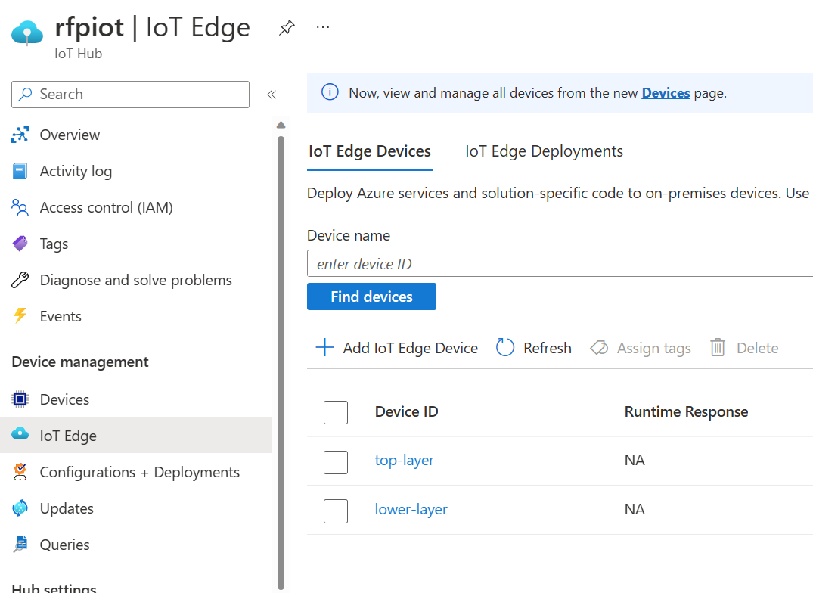
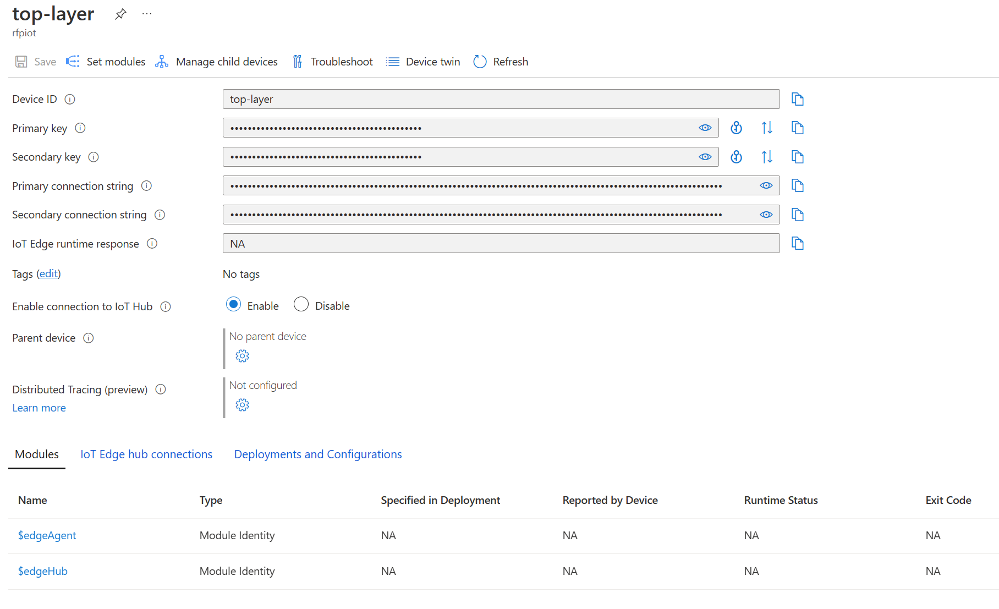
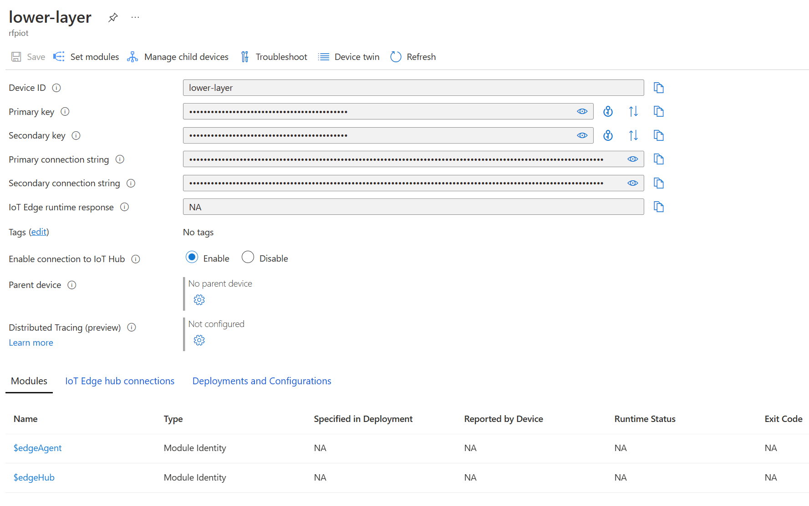
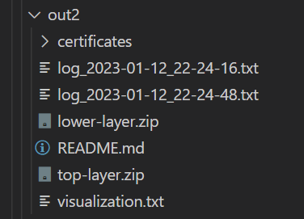
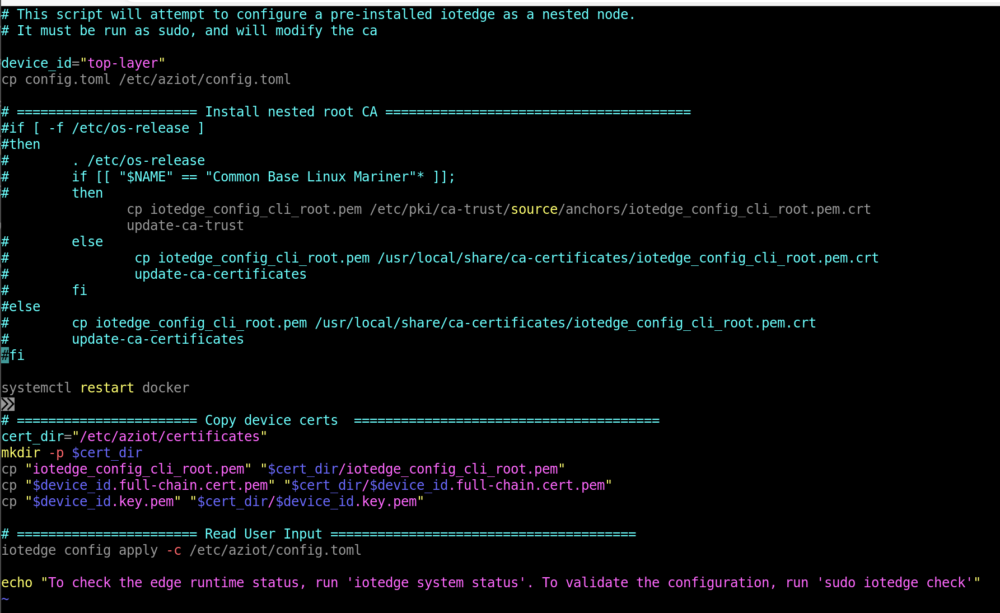
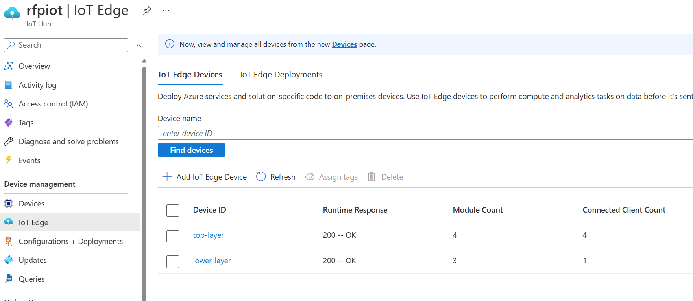
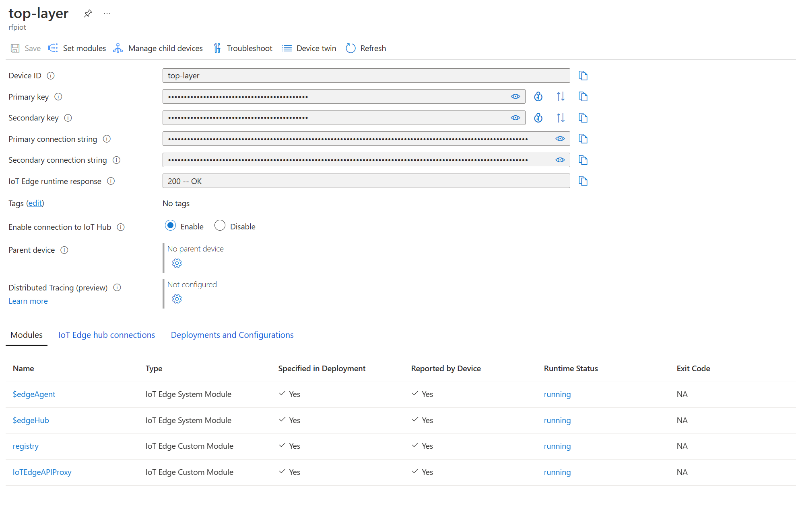
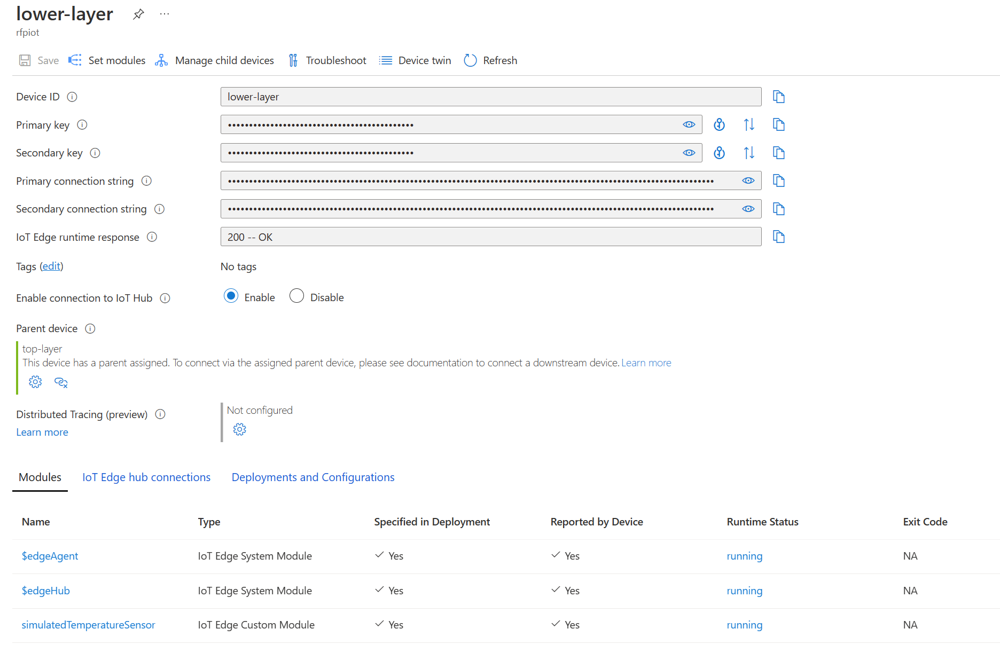

# Lab 04. IoT Edge Chaining

This tutorial was created from the oficial [documentation](https://learn.microsoft.com/en-us/azure/iot-edge/tutorial-nested-iot-edge?view=iotedge-1.4).

## Step 0. Setup tool

We are going to use an utility tool to simplify 2 tasks:
- Creating the self-signed certificates and `config.toml` configuration for each IoT Edge in the chain.
- Register the IoT Edge devices on IoT Hub.

Just download and extract the tool:

```
mkdir nestedIotEdgeTutorial

cd nestedIotEdgeTutorial
wget -O iotedge_config.tar "https://github.com/Azure-Samples/iotedge_config_cli/releases/download/latest/iotedge_config_cli.tar.gz"
tar -xvf iotedge_config.tar
```

## Step 1. Deploy or re-use existing edge hosts

For this exercise we need two IoT Edge hosts. We can deploy 2 VMs, for example using the below template or jsut use existing hosts.

### Using this template (creates VMs with public IPs)

Deploy 2 VMs using:

```
az deployment group create \
  --resource-group iot-chain \
  --template-uri "https://raw.githubusercontent.com/Azure/iotedge-vm-deploy/1.4/edgeDeploy.json" \
  --parameters dnsLabelPrefix='rfp-iotchain-parent' \
  --parameters adminUsername='azurelocal' \
  --parameters authenticationType='sshPublicKey' \
  --parameters adminPasswordOrKey="$(< ~/.ssh/azure_vms_id_rsa.pub)" \
  --query "properties.outputs.[publicFQDN.value, publicSSH.value]" -o tsv

  az deployment group create \
  --resource-group iot-chain \
  --template-uri "https://raw.githubusercontent.com/Azure/iotedge-vm-deploy/1.4/edgeDeploy.json" \
  --parameters dnsLabelPrefix='rfp-iotchain-child' \
  --parameters adminUsername='azurelocal' \
  --parameters authenticationType='sshPublicKey' \
  --parameters adminPasswordOrKey="$(< ~/.ssh/azure_vms_id_rsa.pub)" \
  --query "properties.outputs.[publicFQDN.value, publicSSH.value]" -o tsv
```

### Or having the machines created in another way

Now we just need to instal IoT Edge software. For RedHat 8.x you can follow these [steps](./install-iotedge.md).


## Step 3. Create devices on IoT Hub and generate certificates on Cloud Shell or az cli


### Customize configuration

Customize your settings by editing the file:

```
code nestedIotEdgeTutorial/iotedge_config_cli_release/templates/tutorial/iotedge_config.yaml
```

Populate these:

- In the iothub section, populate the **iothub_hostname** and **iothub_name**.
- Rename the **device_id** both for the top and lower tiers.
- Define the **hostname** with the IP address for the top and lower edge devices.

Below you can find a compelçte example:

```
config_version: "1.0"

iothub:
  iothub_hostname: rfpiot.azure-devices.net
  iothub_name: rfpiot
  ## Authentication method used by IoT Edge devices: symmetric_key or x509_certificate
  authentication_method: symmetric_key 

## Root certificate used to generate device CA certificates. Optional. If not provided a self-signed CA will be generated
# certificates:
#   root_ca_cert_path: ""
#   root_ca_cert_key_path: ""

## IoT Edge configuration template to use
configuration:
  template_config_path: "./templates/tutorial/device_config.toml"
  default_edge_agent: "$upstream:443/azureiotedge-agent:1.2"

## Hierarchy of IoT Edge devices to create
edgedevices:
  device_id: top-layer
  edge_agent: "mcr.microsoft.com/azureiotedge-agent:1.2" ## Optional. If not provided, default_edge_agent will be used
  deployment: "./templates/tutorial/deploymentTopLayer.json" ## Optional. If provided, the given deployment file will be applied to the newly created device
  # hostname: "FQDN or IP" ## Optional. If provided, install.sh will not prompt user for this value nor the parent_hostname value
  hostname: "10.0.1.4"
  child:
    - device_id: lower-layer
      deployment: "./templates/tutorial/deploymentLowerLayer.json" ## Optional. If provided, the given deployment file will be applied to the newly created device
      # hostname: "FQDN or IP" ## Optional. If provided, install.sh will not prompt user for this value nor the parent_hostname value
      hostname: "10.0.2.4"
```

Save and close.

### Generate configuration package

Create a new output directory:

```
mkdir nestedIotEdgeTutorial/iotedge_config_cli_release/myoutput
```

Run it in Azure Cloud Shell or Azure CLI. IF using Azure CLI you need to first authenticate yoyurself:

```
az login --tenant xxxxxxxx
az account set -s yyyyyyyy

cd nestedIotEdgeTutorial/iotedge_config_cli_release
sudo ./iotedge_config --config ./templates/tutorial/iotedge_config.yaml --output ./myoutput
```

It will create 2 devices on IoT Hub and generate all the assets needed for configuation, like in this example.

Edge devices:



Modules for the top edge device:



Modules for the lower edge device:



In the output folder you can see something like this:



Just copy and extract these files in your edge devices:
- `top-layer.zip` to the top layer device. 
- `lower-layer.zip` to the lower layer device. 


## Step 4. Install configuration packages

### Edit install.sh

On both the top and lower edge devices, edit install.sh to comment the lines that are not targeting Red Hat for installing the nested root CA. For Red Hat you should leave these lines to be executed:

```
cp iotedge_config_cli_root.pem /etc/pki/ca-trust/source/anchors/iotedge_config_cli_root.pem.crt
update-ca-trust
```

This is the final example:




### Install on top layer device

```
sudo ./install.sh
```

You can check with:

```
sudo iotedge check
```

### Install on lower layer device

```
sudo ./install.sh
```

You can check with:

```
sudo iotedge check
```

If you find some errors just run this command replacing your top layer IP address:

```
sudo iotedge check --diagnostics-image-name <top_layer_ip_address>:443/azureiotedge-diagnostics:1.4.3
```

### Check everything

If everything goes OK you should have 2 devices with `200 -- OK`:



And the top layer modules running without errors:



And the lower layer modules running without errors:




You can check that messages are being sent from the lower layer, through the top layer, and into IoT Hub (the simulator module is installed in the lower layer edge device):

```
az iot hub monitor-events -n <your_iot_hub_name> -d <your_lower_layer_devices_id>
```

## Cleanup edge devices

In case you have existing edge devices that were already configured previously, you can remove all the software with these commands:

```
sudo yum remove aziot-edge
```

When the IoT Edge runtime is removed, any containers that it created are stopped but still exist on your device. View all containers to see which ones remain.

```
sudo docker ps -a
```

Delete the containers from your device, including the two runtime containers.

```
sudo docker rm -f <container name>
```
